# Smart Factory Management System

## Introduction
The **Smart Factory Management System** is a robust console-based application designed to manage the core operations of a modern manufacturing facility. Built using C# and the .NET framework, it provides a comprehensive text-based user interface (TUI) powered by `Spectre.Console`.

## Features
- **Role-Based Access Control:** Differentiated access and menus for Directors, Technicians, Sales Agents, and Accountants.
- **Production Management:** Initiate, track, and complete production orders (e.g., Motherboards, Microprocessors) utilizing a fleet of specialized machines.
- **Inventory & Batch Tracking:** Full visibility into finished goods, production batches, and stock capacity.
- **Machine Fleet Maintenance:** Track machine conditions, performance metrics, and perform essential maintenance.
- **Comprehensive Reporting:** Generate dynamic reports on staffing, revenue, machine fleet, and production summaries.
- **Auditing & Logging:** A centralized logging service tracks critical user actions and system events.

## Architecture
The system is cleanly decoupled into three main projects (namespaces):
- **Core:** Contains domain entities like `Factory`, `Employee`, `Machine`, and `Product`. Models the core business rules and state.
- **Services:** Handles infrastructure concerns such as JSON data persistence (`JsonRepository`), authentication, and logging (`LoggerService`).
- **UI:** A rich console application utilizing `Spectre.Console` for interactive menus, tables, and prompts, organized by domain handlers (`ProductMenuHandler`, `ProductionMenuHandler`, etc.).

## Installation / Setup Instructions
1. Ensure you have [.NET 9.0 SDK](https://dotnet.microsoft.com/download) or higher installed.
2. Clone the repository and navigate to the root directory.
3. To restore dependencies and build the project, run:
   ```bash
   dotnet build
   ```
4. To run the application, use:
   ```bash
   dotnet run
   ```
*(Note: Ensure your terminal supports ANSI escape sequences for the best TUI experience.)*

## Usage
Upon starting the application, you will be prompted to log in. Default seeded users are provided based on roles (e.g., `admin`/`admin` for Director, or specific usernames setup by `DataSeeder`).
Navigate through the intuitive TUI using the arrow keys and `Enter` to manage employees, execute production workflows, fulfill sales orders, and review factory reports.

## Learning Experience
Throughout the development of this project, several key software engineering concepts were applied and mastered:
- **Object-Oriented Programming (OOP):** Extensive use of inheritance and polymorphism to model Employees, Machines, and Products.
- **JSON Polymorphic Serialization:** Utilizing `[JsonDerivedType]` attributes to seamlessly serialize and deserialize complex object hierarchies into a single JSON file.
- **Terminal UI Design:** Leveraging `Spectre.Console` to build interactive, aesthetically pleasing, and user-friendly console interfaces beyond standard text output.
- **Layered Architecture:** Decoupling the user interface from business logic and data access, promoting cleaner code and easier maintenance.

## Project Structure & UML Diagram
Below is the comprehensive Mermaid class diagram illustrating the system's architecture, including classes, methods, fields, and their relationships, categorized by their respective projects.

```mermaid
classDiagram
    namespace Core {
        class ProductionBatch {
            +string BatchId
            +string ProductName
            +int Quantity
            +double UnitProductionCost
            +double UnitSellPrice
            +bool IsPriced
            +bool IsSold
            +IReadOnlyListint InventoryIndexes
            +double TotalCost
            +void SetUnitSellPrice()
            +void MarkAsSold()
            +void AddInventoryIndex()
        }
        class Employee {
            <<abstract>>
            -int _idCounter
            +int Id
            +string Name
            +string Username
            +string PasswordHash
            +bool IsFirstTimeLogin
            +string Role
            +void UpdateName()
            +void UpdateUsername()
            +void ChangePassword()
            +void InitializeIdCounter()
            +string ShowActivity()
            +Liststring GetAvailableMenuOptions()
        }
        class Director {
            +string ShowActivity()
            +Liststring GetAvailableMenuOptions()
        }
        class Technician {
            +string ShowActivity()
            +Liststring GetAvailableMenuOptions()
        }
        class SalesAgent {
            +string ShowActivity()
            +Liststring GetAvailableMenuOptions()
        }
        class Accountant {
            +string ShowActivity()
            +Liststring GetAvailableMenuOptions()
        }
        class ProductionOrder {
            +string OrderId
            +string ProductName
            +int Quantity
            +int CompletedCount
            +int AssignedTechnicianId
            +bool IsComplete
            +void IncrementCompletedCount()
        }
        class MachineStatus {
            <<enumeration>>
            Running
            Stopped
            Maintenance
        }
        class MachineCondition {
            <<enumeration>>
            Excellent
            Good
            Critical
        }
        class Machine {
            <<abstract>>
            -int _idCounter
            +int Id
            +string Name
            +string Manufacturer
            +string SerialNumber
            +DateTime InstallationDate
            +ListMachinePart Parts
            +MachineStatus Status
            +MachineCondition Condition
            +Type SupportedProductType
            #ProductionOrder ActiveOrder
            +void InitializeIdCounter()
            +TimeSpan GetMachineAge()
            -double GetMachineAgeInYears()
            +void StartOrder()
            +bool StartMachine()
            +void StopMachine()
            #void ApplyProductionWearAndTear()
            +void InspectMachine()
            +bool NeedsRepair()
            +bool RepairMachine()
            -MachineCondition GetMachineCondition()
            +bool Produce()
        }
        class LitographyMachine {
            +bool Produce()
        }
        class SmtMachine {
            +bool Produce()
        }
        class PaPMachine {
            +bool Produce()
        }
        class ReflowOven {
            +bool Produce()
        }
        class ReportStatus {
            <<enumeration>>
            Pending
            Fulfilled
        }
        class ReportRequest {
            +string RequestId
            +string ReportType
            -string RequestedByDirectorName
            +ReportStatus Status
            +void Fulfill()
            +string ToString()
        }
        class Factory {
            +IEnumerableProductionOrder PendingOrders
            +int OrderCount
            +IEnumerableReportRequest PendingReportRequests
            +int ReportRequestCount
            +IReadOnlyListProductionBatch Batches
            +int BatchCount
            +IReadOnlyListEmployee Employees
            +IReadOnlyListMachine Machines
            +IReadOnlyListProduct Inventory
            +int InventoryCapacity
            +void AddEmployee()
            +void AddProduct()
            +void AddOrder()
            +void AddReportRequest()
            +void AddBatch()
        }
        class PartCondition {
            <<enumeration>>
            Excellent
            Good
            Critical
        }
        class MachinePart {
            <<abstract>>
            +string Name
            +PartCondition Condition
            +void BreakDown()
            +void Repair()
            +void DegradeStep()
            +string PrintPartInfo()
        }
        class PowerSupply {
            +int Voltage
            +string PrintPartInfo()
        }
        class CoolingSystem {
            +string Type
            +string PrintPartInfo()
        }
        class ControlUnit {
            +string Processor
            +string PrintPartInfo()
        }
        class AoiSystem {
            +string SystemType
            +string PrintPartInfo()
        }
        class Product {
            <<abstract>>
            -double _productionCost
            -int _quantity
            -double _sellingPrice
            +string Name
            +double ProductionCost
            +double SellingPrice
            +int Quantity
            +void UpdateSellingPrice()
            +void AddQuantity()
            +void DeductQuantity()
            +string GetTechnicalSpecifications()
        }
        class Microprocessor {
            +string Architecture
            +int Cores
            +double ClockSpeed
            +string GetTechnicalSpecifications()
        }
        class BoardState {
            <<enumeration>>
            BlankBoard
            SolderPrinted
            ComponentsPlaced
            BakedAndSoldered
        }
        class Motherboard {
            +BoardState CurrentState
            +string SocketStandard
            +string PhysicalForm
            +void TransitionTo()
            +string GetTechnicalSpecifications()
        }
    }
    namespace Services {
        class IJsonRepository {
            <<interface>>
            +ListT Load()
            +void Save()
        }
        class ILoggerService {
            <<interface>>
            +void LogInfo()
            +void LogWarning()
            +void LogError()
            +void ShowOperationHistory()
        }
        class IAccountService {
            <<interface>>
            +bool UpdateFullName()
            +bool UpdateUsername()
            +bool UpdatePassword()
        }
        class Authentication {
            +Employee Authenticate()
        }
        class AccountService {
            +bool UpdateFullName()
            +bool UpdateUsername()
            +bool UpdatePassword()
            -bool PersistChanges()
        }
        class JsonRepository {
            +ListT Load()
            +void Save()
        }
        class DataSeeder {
            +void Seed()
        }
        class SecurityHelper {
            +string HashPassword()
            +bool VerifyPassword()
        }
        class IFileSystemService {
            <<interface>>
            +void WriteToFile()
            +string ReadFromFile()
            +void AppendToFile()
        }
        class FileSystemService {
            +string BaseDirectory
            +void WriteToFile()
            +string ReadFromFile()
            +void AppendToFile()
        }
        class LogOrigin {
            <<enumeration>>
            SYSTEM
            USER
        }
        class LogEvent {
            <<enumeration>>
            LoginSuccess
            LoginFailed
            Logout
            ProductionStarted
            ProductionInterrupted
        }
        class LoggerService {
            +void LogInfo()
            +void LogWarning()
            +void LogError()
            +void ShowOperationHistory()
            -void WriteToFile()
        }
    }
    namespace UI {
        class LoginMenuHandler {
            +Employee ShowLoginScreen()
        }
        class AccountSettingsMenuHandler {
            +void Run()
            -void ChangeFullName()
            -void ChangeUsername()
            -void ChangePassword()
        }
        class Program {
            -void Main()
        }
        class EmployeeMenuHandler {
        }
        class ProductMenuHandler {
            -void DisplayInventoryTable()
            -void DisplayInventoryAnalytics()
        }
        class AccountingMenuHandler {
            +void Run()
            -void ShowBatches()
            -void SetBatchPrice()
            -void ProcessReportRequests()
        }
        class ProductionMenuHandler {
            -Product CreateProductTemplate()
            -Product CreateProducedProduct()
            -void RunMotherboardWorkflow()
            -bool RunMotherboardStage()
            -void EnsureMachineReady()
            -ListProductionOrder GetPendingOrders()
            -ProductionBatch StartProductionBatch()
        }
        class SalesMenuHandler {
            -void PlaceOrder()
            -ListEmployee GetTechnicians()
            +void ShowPendingOrders()
            -void RecordSale()
        }
        class MenuOptions {
        }
        class PasswordChangeHandler {
            +void Run()
        }
        class ReportMenuHandler {
            +void Run()
            -void ShowEmployeeReport()
            -void RequestPrintableReport()
            -void ShowProductionSummary()
            -void ShowBatchRevenueSummary()
            -void ShowOrderBacklogSummary()
            -int GetTotalInventoryUnits()
            -void Pause()
        }
        class MachineMenuHandler {
            -void DisplayFleetOverview()
            -void RunInspection()
        }
        class TuiHelper {
            +void RenderSessionHeader()
        }
        class FactoryReportMenuHandler {
            +void Run()
            -void ShowOverview()
            -void ShowStaffingReport()
            -void ShowMachineFleetReport()
            -void ShowInventoryReport()
            -void Pause()
        }
    }
    Employee <|-- Director
    Employee <|-- Technician
    Employee <|-- SalesAgent
    Employee <|-- Accountant
    Machine <|-- LitographyMachine
    Machine <|-- SmtMachine
    IFileSystemService <|.. FileSystemService

```


