# 🏭 Smart Factory Management System

  

## 📖 Introduction
The **Smart Factory Management System** is a robust, professional-grade console-based application designed to simulate and manage the core operations of a modern manufacturing facility. Built entirely in C# targeting the .NET 10.0 framework, it provides an advanced Text-based User Interface (TUI) powered by `Spectre.Console`.

It goes beyond simple data entry, featuring complex polymorphic object interactions, layered architecture, simulated production workflows, and real-time state tracking.

---

## ✨ Key Features
- 🔐 **Role-Based Access Control:** Highly differentiated access and menus for diverse user roles (Directors, Technicians, Sales Agents, and Accountants).
- ⚙️ **Production Management:** Initiate, track, and complete intricate production orders (e.g., Motherboards, Microprocessors), utilizing a fleet of specialized machines.
- 📦 **Inventory & Batch Tracking:** Full visibility into finished goods, dynamic production batches, and intelligent stock capacity alerts.
- 🛠️ **Machine Fleet Maintenance:** Meticulous tracking of machine conditions, part degradation, performance metrics, and essential maintenance workflows.
- 📊 **Comprehensive Reporting:** Generate, request, and fulfill dynamic reports on staffing, revenue, machine fleet status, and detailed production summaries.
- 📝 **Auditing & Logging:** A centralized, robust logging service tracks all critical user actions and system events for complete accountability.
- ⏪ **Undo System:** Advanced command pattern implementation allowing users to undo specific sensitive operations.

---

## 🏗️ System Architecture

The repository is strictly modularized into distinct namespaces and projects to enforce separation of concerns, scalability, and maintainability. The system heavily relies on Object-Oriented Programming (OOP) principles, employing deep inheritance hierarchies and interface-driven design.

### 🧠 Core (Domain Layer)
This layer encapsulates all business rules, state, and domain entities. It is completely agnostic of UI or data persistence mechanisms.
- **`Factory`**: The central state manager, orchestrating employees, machines, inventory, and production queues.
- **`Employee` Hierarchy**: An abstract base class branching into `Director`, `Technician`, `SalesAgent`, and `Accountant`. Each subclass dictates specific quick actions and menu options.
- **`Product` Hierarchy**: An abstract base defining common traits (cost, price, stock), inherited by `Microprocessor` and `Motherboard`. Employs polymorphic JSON serialization (`[JsonDerivedType]`).
- **`Machine` & `MachinePart`**: Simulates factory equipment. Machines consist of degradable parts (`PowerSupply`, `CoolingSystem`, `ControlUnit`, `AoiSystem`) that wear down during production and require technician intervention.

### ⚙️ Services (Infrastructure & Logic Layer)
This layer acts as the bridge between the Core domain and external systems (like the file system), enforcing business logic and data persistence.
- **`JsonRepository<T>`**: A generic repository pattern implementation handling polymorphic serialization/deserialization of domain objects to/from JSON files, utilizing `.NET`'s latest JSON features.
- **`Authentication` & `AccountService`**: Manages secure logins, hashing, and role verification.
- **`LoggerService`**: Centralized activity tracking, storing logs with timestamps, origins, and contexts.
- **`UndoService`**: Implements a generic state-reversal mechanism using localized command history.

### 🖥️ UI (Presentation Layer)
A rich console application leveraging `Spectre.Console` for interactive menus, tables, grids, and prompts.
- **Strict Decoupling**: The UI layer NEVER accesses data stores directly; it exclusively routes requests through the `Services` layer.
- **Handlers (`*MenuHandler.cs`)**: Dedicated handlers for specific modules (e.g., `ProductionMenuHandler`, `MachineMenuHandler`), ensuring the `Program.cs` remains a clean entry point.

---

## 🚀 Installation / Setup Instructions

1. Navigate to the project's **Releases** page on GitHub: [Latest Release](https://github.com/CasperGamingOne/Smart-Factory-Management-System/releases/latest).
2. Download the latest `.zip` release asset.
3. Extract the contents of the `.zip` file to a secure directory of your choice.
4. Run the executable (`SmartFactory_ManagementSystem.exe` or equivalent depending on your OS) directly from the extracted folder.
*(Note: Ensure your terminal supports ANSI escape sequences for the best TUI experience. Modern Windows Terminal, iTerm2, or standard Linux terminals work perfectly).*

---

## 🎮 Usage Guide

Upon launching the application, you will be greeted by the login screen.
- **Default Login**: If running for the first time, default users are seeded. (e.g., `admin`/`admin` for the Director role).
- **Navigation**: Use the `Arrow Keys` (Up/Down) to navigate menus, and `Enter` to select. The UI is designed to be highly intuitive, preventing invalid inputs natively.
- **Workflows**: Technicians manage machines and process orders. Sales Agents manage the product catalog and place new orders. Directors oversee the entire operation and request reports, which Accountants then fulfill.

---

## 📚 Learning Experience

Throughout the development of this project, several advanced software engineering concepts were applied:
- **Advanced OOP:** Extensive use of inheritance, abstract classes, method overriding, and polymorphism to model complex factory entities.
- **Polymorphic JSON Serialization:** Overcoming the challenges of saving and loading lists containing mixed derived types using `[JsonDerivedType]` attributes.
- **Terminal UI Design:** Utilizing `Spectre.Console` to transform a standard text console into an interactive, aesthetically pleasing dashboard.
- **Layered Architecture:** Enforcing strict boundaries between UI, Services, and Core logic, promoting clean code, testability, and easier maintenance.

---

## 🗺️ Project Structure & UML Diagrams

To ensure the architecture is presentation-friendly and easily digestible, the UML diagrams have been split by their respective architectural layers.

### 🧩 Core Domain Diagram
Illustrates the foundational business entities and their deep inheritance structures.

### 🛠️ Services Diagram
Details the infrastructure layer, including generic repositories, logging, and state management.

### 🖥️ UI Handlers Diagram
Showcases the decoupling of presentation logic into specialized module handlers.

