# Smart Factory Management System Project Overview

This overview is generated from the repository and can be mirrored into a GitHub wiki if needed.

## UML Class Inventory

| Type | Kind | Namespace | File | Base Types | Key Members | Summary |
| --- | --- | --- | --- | --- | --- | --- |
| Accountant | class | Smart_Factory_Management_System | Employee.cs | Employee | Accountant(string name); AfiseazaActivitate(): void; OpenRoleMenu(Factory factory): void | Concrete implementation used by the application runtime. |
| AccountingMenuHandler | class | Smart_Factory_Management_System | AccountingMenuHandler.cs | - | Run(Factory factory, Employee loggedInUser): void; ShowBatches(Factory factory): void; SetBatchPrice(Factory factory): void | Concrete implementation used by the application runtime. |
| AOI_System | class | Smart_Factory_Management_System | MachinePart.cs | MachinePart | SystemType: string; AOI_System(string name, PartCondition? condition, string systemType); PrintPartInfo(): string | Concrete implementation used by the application runtime. |
| BoardState | enum | Smart_Factory_Management_System | Product.cs | - | BlankBoard, SolderPrinted, ComponentsPlaced, BakedAndSoldered | Enumeration used for state or category modeling. |
| Control_Unit | class | Smart_Factory_Management_System | MachinePart.cs | MachinePart | Processor: string; Control_Unit(string name, PartCondition? condition, string processor); PrintPartInfo(): string | Concrete implementation used by the application runtime. |
| Cooling_System | class | Smart_Factory_Management_System | MachinePart.cs | MachinePart | Type: string; Cooling_System(string name, PartCondition? condition, string type); PrintPartInfo(): string | Concrete implementation used by the application runtime. |
| Director | class | Smart_Factory_Management_System | Employee.cs | Employee | Director(string name); AfiseazaActivitate(): void; OpenRoleMenu(Factory factory): void | Concrete implementation used by the application runtime. |
| Employee | abstract class | Smart_Factory_Management_System | Employee.cs | - | Id: int; Name: string; Role: string; Employee(string name); AfiseazaActivitate(): void; OpenRoleMenu(Factory factory): void | Abstract base class that defines shared behavior. |
| EmployeeMenuHandler | class | Smart_Factory_Management_System | EmployeeMenuHandler.cs | - | Run(Factory factory, Employee loggedInUser): void; DisplayStaffTable(Factory factory): void; AddNewEmployeeFlow(Factory factory): void | Concrete implementation used by the application runtime. |
| Factory | class | Smart_Factory_Management_System | Factory.cs | - | PendingOrders: ProductionOrder[]; OrderCount: int; Batches: ProductionBatch[]; BatchCount: int; Employees: Employee[]; Machines: Machine[] | Concrete implementation used by the application runtime. |
| Litography_Machine | class | Smart_Factory_Management_System | Machine.cs | Machine | Litography_Machine(string machine_name, string machine_manufacturer, string machine_serial, MachinePart[] parts, MachineCondition condition); Produce(Product blueprint): void | Concrete implementation used by the application runtime. |
| LoginHandler | class | Smart_Factory_Management_System | LoginHandler.cs | - | ShowLoginScreen(Factory factory): Employee? | Concrete implementation used by the application runtime. |
| Machine | abstract class | Smart_Factory_Management_System | Machine.cs | - | Id: int; Name: string?; Manufacturer: string?; SerialNumber: string?; InstallationDate: DateTime; Parts: MachinePart[]? | Abstract base class that defines shared behavior. |
| MachineCondition | enum | Smart_Factory_Management_System | Machine.cs | - | Excellent, Good, Critical | Enumeration used for state or category modeling. |
| MachineMenuHandler | class | Smart_Factory_Management_System | MachineMenuHandler.cs | - | Run(Factory factory, Employee loggedInUser): void; DisplayFleetOverview(Factory factory): void; RunInspection(Factory factory): void | Concrete implementation used by the application runtime. |
| MachinePart | abstract class | Smart_Factory_Management_System | MachinePart.cs | - | Name: string?; Condition: PartCondition?; MachinePart(string name, PartCondition? condition); BreakDown(): void; Repair(PartCondition restoredCondition): void; DegradeStep(): void | Abstract base class that defines shared behavior. |
| MachineStatus | enum | Smart_Factory_Management_System | Machine.cs | - | Running, Stopped, Maintenance | Enumeration used for state or category modeling. |
| MenuOptions | class | Smart_Factory_Management_System | MenuOptions.cs | - | No detected public members | Concrete implementation used by the application runtime. |
| Microprocessor | class | Smart_Factory_Management_System | Product.cs | Product | Architecture: string?; Microprocessor(string name, double cost, double price, int quantity, int cores, double clockSpeed); GetTechnicalSpecifications(): string | Concrete implementation used by the application runtime. |
| Motherboard | class | Smart_Factory_Management_System | Product.cs | Product | CurrentState: BoardState; TransitionTo(BoardState nextState): void; SocketStandard: string?; PhysicalForm: string?; Motherboard(string name, double cost, double price, int quantity, string socket, string type); GetTechnicalSpecifications(): string | Concrete implementation used by the application runtime. |
| PaP_Machine | class | Smart_Factory_Management_System | Machine.cs | Machine | PaP_Machine(string machine_name, string machine_manufacturer, string machine_serial, MachinePart[] parts, MachineCondition condition); Produce(Product product): void | Concrete implementation used by the application runtime. |
| PartCondition | enum | Smart_Factory_Management_System | MachinePart.cs | - | Excellent, Good, Critical | Enumeration used for state or category modeling. |
| Power_Supply | class | Smart_Factory_Management_System | MachinePart.cs | MachinePart | Voltage: int; Power_Supply(string name, PartCondition? condition, int voltage); PrintPartInfo(): string | Concrete implementation used by the application runtime. |
| Product | abstract class | Smart_Factory_Management_System | Product.cs | - | Name: string?; Cores: int?; ClockSpeed: double; ProductionDate: DateTime; CalculeazaMarjaProfit(): double; Quantity: int | Abstract base class that defines shared behavior. |
| ProductionBatch | class | Smart_Factory_Management_System | ProductionBatch.cs | - | BatchId: string; ProductName: string; Quantity: int; UnitProductionCost: double; UnitSellPrice: double?; SoldUnitPrice: double? | Concrete implementation used by the application runtime. |
| ProductionMenuHandler | class | Smart_Factory_Management_System | ProductionMenuHandler.cs | - | Run(Factory factory, Employee loggedInUser): void | Concrete implementation used by the application runtime. |
| ProductionOrder | class | Smart_Factory_Management_System | ProductionOrder.cs | - | OrderId: string; ProductName: string; Quantity: int; CompletedCount: int; AssignedTechnicianId: int; ProductionOrder(string productName, int quantity, int technicianId) | Concrete implementation used by the application runtime. |
| ProductMenuHandler | class | Smart_Factory_Management_System | ProductMenuHandler.cs | - | Run(Factory factory, Employee currentUser): void; DisplayInventoryTable(Factory factory): void; DisplayInventoryAnalytics(Factory factory): void; HandleManualProductRegistration(Factory factory, Employee currentUser): void | Concrete implementation used by the application runtime. |
| Program | class | Smart_Factory_Management_System | Program.cs | - | No detected public members | Concrete implementation used by the application runtime. |
| Reflow_Oven | class | Smart_Factory_Management_System | Machine.cs | Machine | Reflow_Oven(string machine_name, string machine_manufacturer, string machine_serial, MachinePart[] parts, MachineCondition condition); Produce(Product product): void | Concrete implementation used by the application runtime. |
| ReportMenuHandler | class | Smart_Factory_Management_System | ReportMenuHandler.cs | - | Run(Factory factory, Employee loggedInUser): void | Concrete implementation used by the application runtime. |
| SalesAgent | class | Smart_Factory_Management_System | Employee.cs | Employee | SalesAgent(string name); AfiseazaActivitate(): void; OpenRoleMenu(Factory factory): void | Concrete implementation used by the application runtime. |
| SalesMenuHandler | class | Smart_Factory_Management_System | SalesMenuHandler.cs | - | Run(Factory factory, Employee loggedInUser): void; PlaceOrder(Factory factory, SalesAgent sales): void; ShowPendingOrders(Factory factory): void; RecordSale(Factory factory): void | Concrete implementation used by the application runtime. |
| SMT_Machine | class | Smart_Factory_Management_System | Machine.cs | Machine | SMT_Machine(string machine_name, string machine_manufacturer, string machine_serial, MachinePart[] parts, MachineCondition condition); Produce(Product product): void | Concrete implementation used by the application runtime. |
| Technician | class | Smart_Factory_Management_System | Employee.cs | Employee | Technician(string name); AfiseazaActivitate(): void; OpenRoleMenu(Factory factory): void | Concrete implementation used by the application runtime. |
| UIHelpers | class | Smart_Factory_Management_System | UIHelpers.cs | - | RenderSessionHeader(Employee user, Factory factory): void | Concrete implementation used by the application runtime. |

## File Inventory

| Path | Role | Parsed Types |
| --- | --- | --- |
| .gitattributes | Repository asset. | - |
| .gitignore | Repository asset. | - |
| AccountingMenuHandler.cs | Menu navigation and role-specific UI flow. | AccountingMenuHandler |
| CODE_OF_CONDUCT.md | Repository documentation. | - |
| Employee.cs | Core domain model and supporting entities. | Accountant, Director, Employee, SalesAgent, Technician |
| EmployeeMenuHandler.cs | Menu navigation and role-specific UI flow. | EmployeeMenuHandler |
| Factory.cs | Core domain model and supporting entities. | Factory |
| LICENSE.txt | Repository asset. | - |
| LoginHandler.cs | Authentication and login flow. | LoginHandler |
| Machine.cs | Core domain model and supporting entities. | Litography_Machine, Machine, MachineCondition, MachineStatus, PaP_Machine, Reflow_Oven, SMT_Machine |
| MachineMenuHandler.cs | Menu navigation and role-specific UI flow. | MachineMenuHandler |
| MachinePart.cs | Core domain model and supporting entities. | AOI_System, Control_Unit, Cooling_System, MachinePart, PartCondition, Power_Supply |
| MenuOptions.cs | Shared menu labels and command lists. | MenuOptions |
| Product.cs | Core domain model and supporting entities. | BoardState, Microprocessor, Motherboard, Product |
| ProductMenuHandler.cs | Menu navigation and role-specific UI flow. | ProductMenuHandler |
| ProductionBatch.cs | Core domain model and supporting entities. | ProductionBatch |
| ProductionMenuHandler.cs | Menu navigation and role-specific UI flow. | ProductionMenuHandler |
| ProductionOrder.cs | Core domain model and supporting entities. | ProductionOrder |
| Program.cs | Application entry point and session loop. | Program |
| README.md | Repository documentation. | - |
| ReportMenuHandler.cs | Menu navigation and role-specific UI flow. | ReportMenuHandler |
| SECURITY.md | Repository documentation. | - |
| SalesMenuHandler.cs | Menu navigation and role-specific UI flow. | SalesMenuHandler |
| Smart-Factory-Management-System.csproj | Project build definition and package references. | - |
| Smart-Factory-Management-System.slnx | Solution file. | - |
| UIHelpers.cs | Shared console rendering helpers. | UIHelpers |
| global.json | Repository asset. | - |
| index.html | Repository asset. | - |
| docs/PROJECT_OVERVIEW.md | Repository documentation. | - |
| scripts/generate_repo_map.py | Documentation generator script. | - |

## Mermaid UML

```mermaid
classDiagram
direction LR

class Accountant {
  +Accountant(string name)
  +AfiseazaActivitate(): void
  +OpenRoleMenu(Factory factory): void
}
class AccountingMenuHandler {
  +Run(Factory factory, Employee loggedInUser): void
  +ShowBatches(Factory factory): void
  +SetBatchPrice(Factory factory): void
}
class AOI_System {
  +SystemType: string
  +AOI_System(string name, PartCondition? condition, string systemType)
  +PrintPartInfo(): string
}
class BoardState <<enumeration>> {
  +BlankBoard, SolderPrinted, ComponentsPlaced, BakedAndSoldered
}
class Control_Unit {
  +Processor: string
  +Control_Unit(string name, PartCondition? condition, string processor)
  +PrintPartInfo(): string
}
class Cooling_System {
  +Type: string
  +Cooling_System(string name, PartCondition? condition, string type)
  +PrintPartInfo(): string
}
class Director {
  +Director(string name)
  +AfiseazaActivitate(): void
  +OpenRoleMenu(Factory factory): void
}
class Employee <<abstract>> {
  +Id: int
  +Name: string
  +Role: string
  +Employee(string name)
  +AfiseazaActivitate(): void
  +OpenRoleMenu(Factory factory): void
}
class EmployeeMenuHandler {
  +Run(Factory factory, Employee loggedInUser): void
  +DisplayStaffTable(Factory factory): void
  +AddNewEmployeeFlow(Factory factory): void
}
class Factory {
  +PendingOrders: ProductionOrder
  +OrderCount: int
  +Batches: ProductionBatch
  +BatchCount: int
  +Employees: Employee
  +Machines: Machine
  +Inventory: Product
  +Factory()
  +SeedInitialData(): void
  +AddEmployee(Employee employee): void
  +AddMachine(Machine machine): void
  +AddProduct(Product product): void
  +AddProduct(Product product, string? batchId): void
  +AddOrder(ProductionOrder order): void
}
class Litography_Machine {
  +Litography_Machine(string machine_name, string machine_manufacturer, string machine_serial, MachinePart parts, MachineCondition condition)
  +Produce(Product blueprint): void
}
class LoginHandler {
  +ShowLoginScreen(Factory factory): Employee?
}
class Machine <<abstract>> {
  +Id: int
  +Name: string?
  +Manufacturer: string?
  +SerialNumber: string?
  +InstallationDate: DateTime
  +Parts: MachinePart?
  +Status: MachineStatus
  +Condition: MachineCondition
  +SupportedProductType: Type
  +ActiveOrder: ProductionOrder?
  +Machine(string machine_name, string machine_manufacturer, string machine_serial, MachinePart parts, MachineCondition condition)
  +GetMachineAge(): TimeSpan
  +StartOrder(ProductionOrder order): void
  +StartMachine(): bool
}
class MachineCondition <<enumeration>> {
  +Excellent, Good, Critical
}
class MachineMenuHandler {
  +Run(Factory factory, Employee loggedInUser): void
  +DisplayFleetOverview(Factory factory): void
  +RunInspection(Factory factory): void
}
class MachinePart <<abstract>> {
  +Name: string?
  +Condition: PartCondition?
  +MachinePart(string name, PartCondition? condition)
  +BreakDown(): void
  +Repair(PartCondition restoredCondition): void
  +DegradeStep(): void
  +PrintPartInfo(): string
}
class MachineStatus <<enumeration>> {
  +Running, Stopped, Maintenance
}
class MenuOptions {
}
class Microprocessor {
  +Architecture: string?
  +Microprocessor(string name, double cost, double price, int quantity, int cores, double clockSpeed)
  +GetTechnicalSpecifications(): string
}
class Motherboard {
  +CurrentState: BoardState
  +TransitionTo(BoardState nextState): void
  +SocketStandard: string?
  +PhysicalForm: string?
  +Motherboard(string name, double cost, double price, int quantity, string socket, string type)
  +GetTechnicalSpecifications(): string
}
class PaP_Machine {
  +PaP_Machine(string machine_name, string machine_manufacturer, string machine_serial, MachinePart parts, MachineCondition condition)
  +Produce(Product product): void
}
class PartCondition <<enumeration>> {
  +Excellent, Good, Critical
}
class Power_Supply {
  +Voltage: int
  +Power_Supply(string name, PartCondition? condition, int voltage)
  +PrintPartInfo(): string
}
class Product <<abstract>> {
  +Name: string?
  +Cores: int?
  +ClockSpeed: double
  +ProductionDate: DateTime
  +CalculeazaMarjaProfit(): double
  +Quantity: int
  +Product(string name, double cost, double price, int quantity)
  +GetTechnicalSpecifications(): string
}
class ProductionBatch {
  +BatchId: string
  +ProductName: string
  +Quantity: int
  +UnitProductionCost: double
  +UnitSellPrice: double?
  +SoldUnitPrice: double?
  +IsSold: bool
  +InventoryIndexes: List~int~
  +ProductionBatch(string productName, int quantity, double unitCost)
}
class ProductionMenuHandler {
  +Run(Factory factory, Employee loggedInUser): void
}
class ProductionOrder {
  +OrderId: string
  +ProductName: string
  +Quantity: int
  +CompletedCount: int
  +AssignedTechnicianId: int
  +ProductionOrder(string productName, int quantity, int technicianId)
}
class ProductMenuHandler {
  +Run(Factory factory, Employee currentUser): void
  +DisplayInventoryTable(Factory factory): void
  +DisplayInventoryAnalytics(Factory factory): void
  +HandleManualProductRegistration(Factory factory, Employee currentUser): void
}
class Program {
}
class Reflow_Oven {
  +Reflow_Oven(string machine_name, string machine_manufacturer, string machine_serial, MachinePart parts, MachineCondition condition)
  +Produce(Product product): void
}
class ReportMenuHandler {
  +Run(Factory factory, Employee loggedInUser): void
}
class SalesAgent {
  +SalesAgent(string name)
  +AfiseazaActivitate(): void
  +OpenRoleMenu(Factory factory): void
}
class SalesMenuHandler {
  +Run(Factory factory, Employee loggedInUser): void
  +PlaceOrder(Factory factory, SalesAgent sales): void
  +ShowPendingOrders(Factory factory): void
  +RecordSale(Factory factory): void
}
class SMT_Machine {
  +SMT_Machine(string machine_name, string machine_manufacturer, string machine_serial, MachinePart parts, MachineCondition condition)
  +Produce(Product product): void
}
class Technician {
  +Technician(string name)
  +AfiseazaActivitate(): void
  +OpenRoleMenu(Factory factory): void
}
class UIHelpers {
  +RenderSessionHeader(Employee user, Factory factory): void
}

Accountant --|> Employee
Accountant ..> Factory : uses
AccountingMenuHandler ..> Employee : uses
AccountingMenuHandler ..> Factory : uses
AOI_System --|> MachinePart
AOI_System ..> PartCondition : uses
Control_Unit --|> MachinePart
Control_Unit ..> PartCondition : uses
Cooling_System --|> MachinePart
Cooling_System ..> PartCondition : uses
Director --|> Employee
Director ..> Factory : uses
Employee ..> Factory : uses
EmployeeMenuHandler ..> Employee : uses
EmployeeMenuHandler ..> Factory : uses
Factory ..> Employee : uses
Factory ..> Machine : uses
Factory ..> Product : uses
Factory ..> ProductionBatch : uses
Factory ..> ProductionOrder : uses
Litography_Machine --|> Machine
Litography_Machine ..> MachineCondition : uses
Litography_Machine ..> MachinePart : uses
Litography_Machine ..> Product : uses
LoginHandler ..> Employee : uses
LoginHandler ..> Factory : uses
Machine ..> MachineCondition : uses
Machine ..> MachinePart : uses
Machine ..> MachineStatus : uses
Machine ..> Product : uses
Machine ..> ProductionOrder : uses
MachineMenuHandler ..> Employee : uses
MachineMenuHandler ..> Factory : uses
MachinePart ..> PartCondition : uses
Microprocessor --|> Product
Motherboard --|> Product
Motherboard ..> BoardState : uses
PaP_Machine --|> Machine
PaP_Machine ..> MachineCondition : uses
PaP_Machine ..> MachinePart : uses
PaP_Machine ..> Product : uses
Power_Supply --|> MachinePart
Power_Supply ..> PartCondition : uses
ProductionMenuHandler ..> Employee : uses
ProductionMenuHandler ..> Factory : uses
ProductMenuHandler ..> Employee : uses
ProductMenuHandler ..> Factory : uses
Reflow_Oven --|> Machine
Reflow_Oven ..> MachineCondition : uses
Reflow_Oven ..> MachinePart : uses
Reflow_Oven ..> Product : uses
ReportMenuHandler ..> Employee : uses
ReportMenuHandler ..> Factory : uses
SalesAgent --|> Employee
SalesAgent ..> Factory : uses
SalesMenuHandler ..> Employee : uses
SalesMenuHandler ..> Factory : uses
SalesMenuHandler ..> SalesAgent : uses
SMT_Machine --|> Machine
SMT_Machine ..> MachineCondition : uses
SMT_Machine ..> MachinePart : uses
SMT_Machine ..> Product : uses
Technician --|> Employee
Technician ..> Factory : uses
UIHelpers ..> Employee : uses
UIHelpers ..> Factory : uses
```

